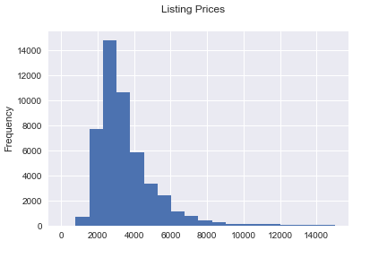
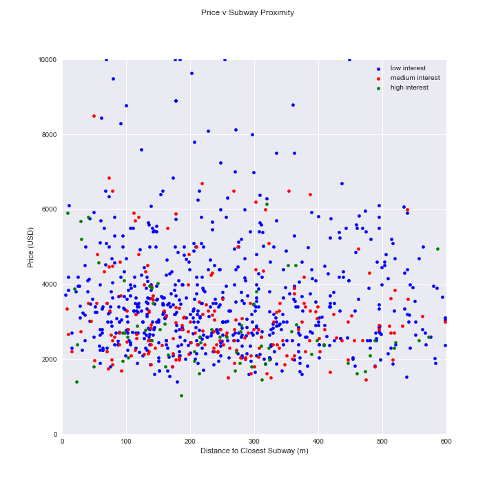
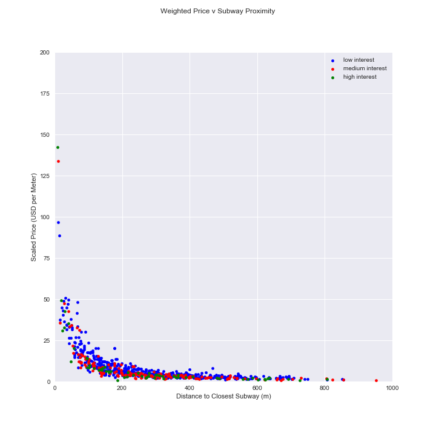

# NYC Rental Listing Data EDA
This project is Exploratory Data Analysis for the Data Science program at [K2 Data Science](http://k2datascience.com).

My goal with this project was to clean the NYC Rental Listing Data and to visualize relationships between rental price/interest and its proximity to Subways.

## Background
This dataset comes from [Kaggle](https://www.kaggle.com/c/two-sigma-connect-rental-listing-inquiries) and its goal is to predict the interest level in New York rental properties based on information from
rental listings. The training dataset contains various aspects of rental listing information and your goal is to relate the mostly 
numerical variables to rental’s interest level. Interest level is simply the number of inquiries a new listing receives.

## Question 
How does proximity to Subways influence a rental’s price or interest level?

Subway is one of the preferred modes of transportation in NYC. It seems intuitive to expect a correlation between rental price and distance to the closest subway. Is there correlation between price and distance to the nearest subway? What about once you account for the other factors that influence price (such as number of bedrooms and bathrooms)? Do we see a similar relationship between the distance to the nearest subway and interest level?

## Data 
The data is in JSON format which stands for JavaScript Object Notation and is a lightweight data-interchange format mostly 
used in web development. JSON is briefly covered in the API section in “Getting and Cleaning Data”.  Don’t worry too much about JSON, 
but if you work as a web developer you will likely encounter JSON again. It is simply another way to markup data in vein of HTML or XML, 
except that it is simpler because it is a collection of name/value pairs similar to a dictionary in python. 
Pandas comes with a convenient pandas.read_json method that will parse the training data into a pandas DataFrame similar 
to how you could read a csv or other tabular data format. However, you will notice that the row index is not sequential, 
and you may want to run reset_index() to fix this.

Each listing gives the following information:

Date of listing creation
1. Number of bathrooms (float values that include half bathrooms)
2. Number of bedrooms
3. Building_id
4. Description of rental property
5. Display_address
6. List of features about this apartment
7. Geo location (latitude, longitude)
8. A list of photos of the rental property
9. Price: in USD
10. Street address
11. Interest_level that this listing generated. Ordinal values of: 'high', 'medium' and 'low'

## Basic Exploration and Cleaning

The data contained some extreme outliers as illustrated by this scatter plot
price_bedrooms_scatter.png

After cleaning the data we can get a sense of the listings we are looking at. We see a large amount of the listings with "Low Interest" (about 69.5%),
likely caused by the limited supply of housing in New York City. And we see the majority of monthly rents falling between $2000 and $4000.

A quick scatter plot comparing price to bedrooms show prices generally rising with bedrooms, and higher interest for lower prices

## How does proximity to Subways influence a rental’s price or interest level?

With a basic understanding of the data we are able to compare what we found to subway proximity. To do this I used [NYC Open Data](https://opendata.cityofnewyork.us/) 
which makes available the location of all subway stations in New York City, combined with [Geopy](https://pypi.python.org/pypi/geopy) which allows
us to easily find the distance between two coordinates. 

At first look there is no relationship between subway proximity and price/interest.

But when you account for the number of bedrooms and bathrooms in each listing, price shoots up when in close proximity to a subway.
Higher interest listings show lower prices for the same distance froma  subway.

## Relationship between features and interest Level
Finding the answer to my intitial question I chose to further break out the features in each listing to see if there were any common features
that high interest listings contained.

An initial look at all features:

High Interest listings focused on hardwood floors, elevators, and No Fee.

Low Interest Listings also found elevators very common, but also allowing pets
low_feature_counts.png

Weighting the features (since low interest listings made up over half the data) allows us to see the features that set low and high interest listings 
appart. Hardwood floors and No Fee listings stand out in getting more interest. While a Doorman does not seem to add much interest to a listing.

